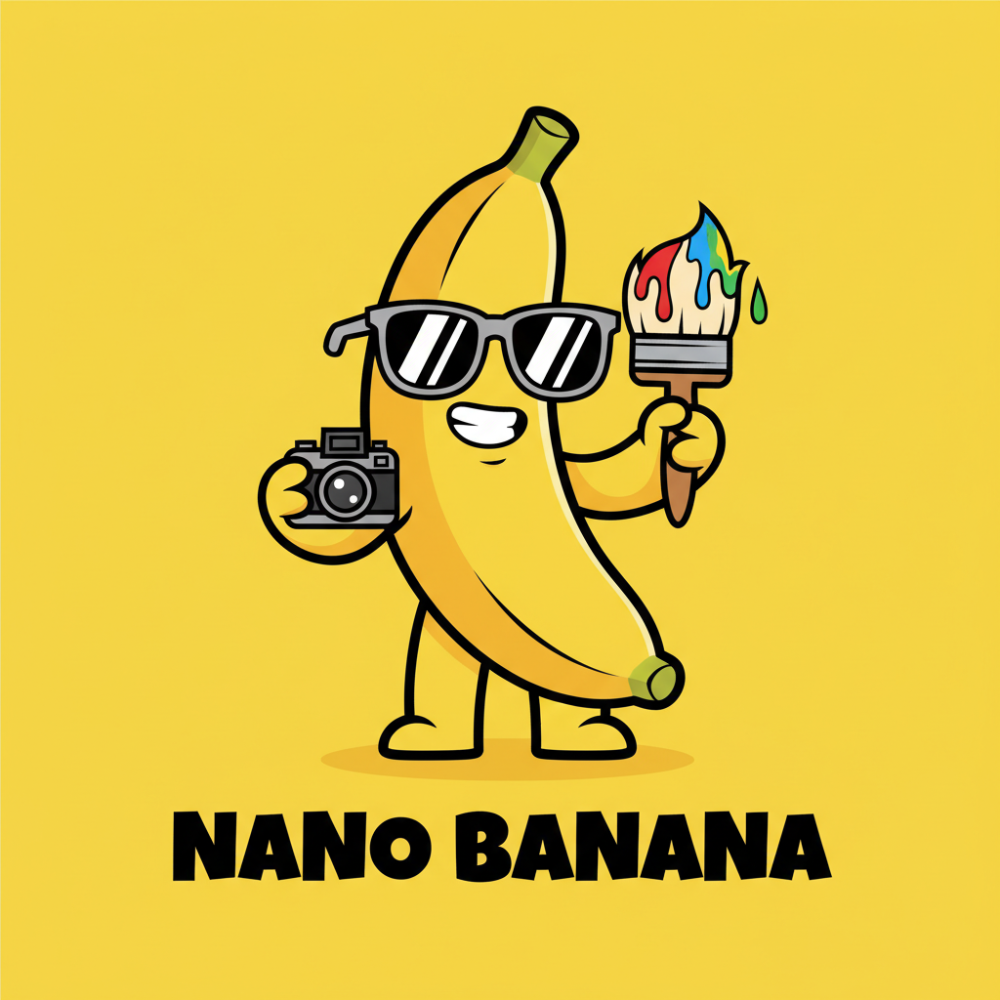
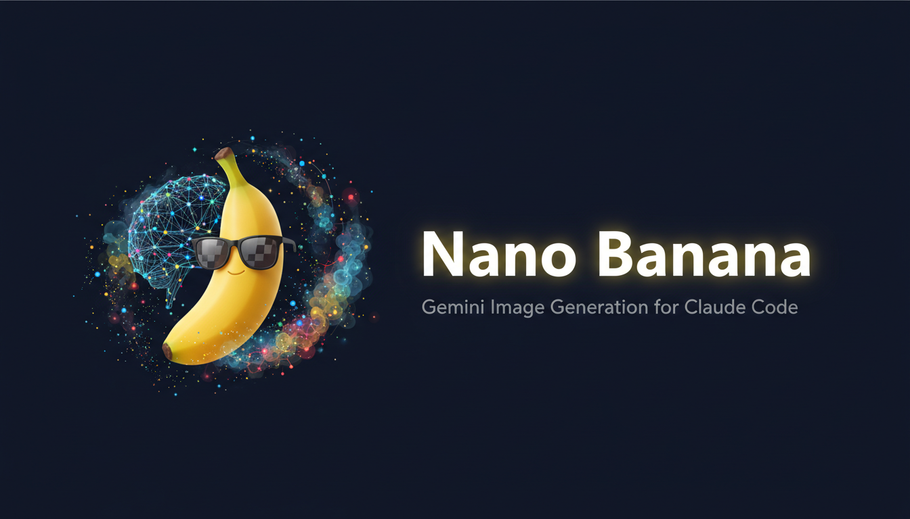

<div align="center">



# Nano Banana 2

**Generate and edit images right inside Claude Code, powered by Google Gemini 3.1**

[](https://claude.ai/claude-code)
[](https://ai.google.dev/)
[](LICENSE)
[](CHANGELOG.md)
[](https://www.python.org/)
[](CONTRIBUTING.md)

*Describe what you want. Get an image back. It's that simple.*

[Features](#features) · [Install](#installation) · [Get Started](#get-started) · [Examples](#usage-examples) · [Models](#models) · [Contributing](#contributing)

</div>

---



---

## What is this?

Nano Banana lets you create and edit images without ever leaving Claude Code. Just type what you want in plain English and the plugin handles the rest — picking the right model, enhancing your prompt, and saving the result.

```
/genimage a photorealistic cyberpunk street in Cairo, neon palm trees, 16:9
```

That's a real command. It works exactly like that. No config files, no boilerplate, no switching between tools.

Under the hood it uses Google's Gemini 3.1 Flash for fast generation and Gemini 3 Pro when you need high-resolution output. You don't need to think about which model to use — Nano Banana picks the right one automatically.

Part of the **Nano Banana Claude Code** collection for Claude Code, alongside [SupaConductor](https://github.com/Ibrahim-3d/conductor-orchestrator-supaconductor) for multi-agent orchestration.

---

## Features

- **Text-to-image** — describe anything, get an image back
- **Image editing** — "replace the sky with a sunset" and it just works, no masks needed
- **Style transfer** — apply the look of one image to another
- **Multi-image composition** — blend up to 14 reference images for consistent characters and scenes
- **High-resolution output** — go up to 4K for professional assets
- **Search-grounded generation** — images informed by real-time Google Search data
- **Every aspect ratio** — 1:1, 16:9, 9:16, 4:3, 21:9, and more
- **Iterative editing** — keep refining your image through conversation

All of this runs through a single `/genimage` command. The agent figures out which mode you need from context.

---

## Installation

The quickest way:

```bash
claude plugin add Gurjeetsaini01/nano-banana-claude-plugin
```

Or clone it yourself:

```bash
git clone https://github.com/Gurjeetsaini01/nano-banana-claude-plugin.git ~/.claude/plugins/nano-banana
pip install google-genai python-dotenv Pillow
```

Restart Claude Code after installing to activate the plugin.

---

## Get Started

You'll need a Gemini API key. It's free — grab one at [Google AI Studio](https://aistudio.google.com/apikey) if you don't have one already.

Then inside Claude Code:

```bash
# Step 1 — save your API key (one-time setup)
/nano-banana:setup

# Step 2 — generate your first image
/genimage a golden retriever puppy playing in autumn leaves, soft bokeh, 4:3
```

That's it. Your image gets saved to the current directory. From here you can keep generating, edit what you've made, or try any of the examples below.

---

## Usage Examples

### Create images from text

```bash
/genimage a minimalist flat-design illustration of a coffee shop, pastel colors
/genimage product shot of a black ceramic mug on a marble surface, studio lighting, 1:1
/genimage aerial view of a sci-fi megacity at night, neon lights, cinematic, 21:9
```

### Go high-res (2K / 4K)

Just mention the resolution — the plugin switches to the Pro model automatically:

```bash
/genimage a hyper-detailed fantasy castle on a cliff, waterfall, 4K, 16:9
```

### Edit existing images

All editing is text-guided. Describe the change you want and Nano Banana figures out what to modify:

```bash
# Swap out a background
/genimage replace the plain background in photo.png with a bustling Tokyo street at night

# Remove something
/genimage remove the power lines from landscape.png, preserve everything else

# Transfer a style
/genimage apply the brushstroke style of starry-night.png to my-photo.jpg
```

### Iterate on your work

Generate a base image, then keep refining it:

```bash
# Start with a scene
/genimage a cozy cafe interior, warm lighting, 4:3

# Then add to it
/genimage add a cat sleeping on the counter --images generated_image.png
```

You can chain as many edits as you like — each one builds on the last.

---

## Models

Nano Banana uses two Gemini models and picks the right one for you:

| Model | We call it | When it's used |
|-------|-----------|----------------|
| `gemini-3.1-flash-image-preview` | **Nano Banana 2** | Everything by default — fast, versatile, great quality |
| `gemini-3-pro-image-preview` | **Nano Banana Pro** | When you ask for 2K or 4K resolution |

You don't need to select a model manually. If you pass `--resolution 2K` or `--resolution 4K`, Pro kicks in automatically.

---

## Under the Hood

Everything runs through one Python script:

```
python "$CLAUDE_PLUGIN_ROOT/scripts/genimage.py" --prompt "..." [options]
```

The mode is determined by the flags you pass:

| What you want | How to do it |
|---------------|-------------|
| Generate from text | `--prompt "..."` (that's all you need) |
| Edit an image | `--prompt "what to change" --images source.png` |
| Transfer a style | `--prompt "Apply the style..." --images style.png source.png` |
| Compose from references | `--prompt "..." --images a.png b.png [...]` (up to 14) |
| High resolution | Add `--resolution 2K` or `--resolution 4K` to any of the above |

### Available flags

| Flag | What it does |
|------|-------------|
| `--prompt "text"` | Your instructions (required) |
| `--output filename.png` | Where to save (default: `generated_image.png`) |
| `--images path [path ...]` | Input image(s) for editing, style transfer, or composition |
| `--aspect-ratio` | `1:1`, `16:9`, `9:16`, `4:3`, `3:4`, `21:9`, etc. |
| `--resolution 1K\|2K\|4K` | Output resolution (2K/4K switches to Pro model) |

Most of the time you won't touch these directly — the `/genimage` command handles flag selection for you.

---

## Plugin Structure

```
nano-banana-claude-plugin/
├── .claude-plugin/
│   ├── plugin.json          # Plugin identity and metadata
│   └── marketplace.json     # Ibrahim Plugins marketplace listing
├── agents/
│   └── gemini-image-gen.md  # The autonomous image generation agent
├── commands/
│   ├── genimage.md          # /genimage slash command
│   └── setup.md             # /nano-banana:setup for API key config
├── hooks/
│   └── hooks.json           # Checks for API key on session start
├── skills/
│   └── genimage/
│       └── SKILL.md         # Knowledge the agent uses to pick flags
├── scripts/
│   ├── genimage.py          # The universal generation script
│   ├── setup_key.py         # Saves your API key locally
│   ├── check_env.py         # Validates environment on startup
│   └── utils.py             # Shared client and model constants
└── settings.json            # Auto-activates the image agent
```

---

## Requirements

- **Claude Code** (latest version)
- **Python 3.9+**
- **A Gemini API key** — free from [Google AI Studio](https://aistudio.google.com/apikey)
- Three Python packages: `google-genai`, `python-dotenv`, `Pillow` (installed automatically with marketplace install)

---

## Related Plugins

| Plugin | What it does |
|--------|-------------|
| **[SupaConductor](https://github.com/Ibrahim-3d/conductor-orchestrator-supaconductor)** | Multi-agent orchestration with Evaluate-Loop, parallel execution, and Board of Directors |

Both plugins are part of the Claude Code plugin ecosystem.

---

## Contributing

Contributions are welcome! Check out [CONTRIBUTING.md](CONTRIBUTING.md) for how to report bugs, suggest features, or add new generation modes.

---

## Security

Your API key stays on your machine in `scripts/.env` and never gets committed to version control. See [SECURITY.md](SECURITY.md) for the full policy.

---

## License

[MIT](LICENSE) — free to use, modify, and distribute.

---

<div align="center">

**Built for [Claude Code](https://claude.ai/claude-code)** · Powered by **[Google Gemini 3.1](https://ai.google.dev/)**

**Nano Banana 2** · **Nano Banana Pro** · Made by [Gurjeetsaini01](https://github.com/Gurjeetsaini01)

</div>
