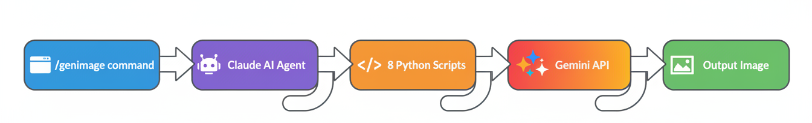

<div align="center">


# Nano Banana

**Google Gemini image generation plugin for Claude Code**

[](https://claude.ai/claude-code)
[](https://ai.google.dev/)
[](LICENSE)
[](CHANGELOG.md)

*One command. Every Gemini image mode.*

</div>

---


---

## What is Nano Banana?

**Nano Banana** is Google's internal codename for Gemini's native image generation model. This plugin wires all of those capabilities directly into Claude Code — a smart slash command, an autonomous AI agent, and 8 Python scripts that cover every generation and editing mode the API supports.

Type `/genimage` and describe what you want. The agent figures out which script to use, crafts a great prompt if yours is rough, and runs it. You get an image.

```
/genimage a photorealistic close-up of a coffee cup on a rainy window ledge, warm lighting
```

---

## How It Works



Everything is **text-guided** through the Gemini API. There is no visual UI, no mask painter, no interactive editor. You describe what you want in natural language — Gemini's AI semantically understands your instructions and applies changes to the right parts of the image automatically.

> Say "replace the sky with a sunset" and Gemini identifies the sky region and replaces it. No masking required.

---

## Installation

### Option 1: Marketplace install

```bash
/plugin marketplace add Ibrahim-3d/nano-banana-claude-plugin
/plugin install nano-banana@nano-banana
```

### Option 2: Clone directly

```bash
git clone https://github.com/Ibrahim-3d/nano-banana-claude-plugin.git ~/.claude/plugins/nano-banana
```

### Install Python dependencies

```bash
pip install google-genai python-dotenv Pillow
```

### Get a Gemini API key

Get your free API key from [Google AI Studio](https://aistudio.google.com/apikey)

### Configure your key

```bash
cp ~/.claude/plugins/nano-banana/scripts/.env.example ~/.claude/plugins/nano-banana/scripts/.env
# Edit .env and add:
# GEMINI_API_KEY=your_key_here
```

### Verify

Start a new Claude Code session. Type `/` and look for `genimage`.

### Troubleshooting

If you see `Permission denied (publickey)` during install:
```bash
git config --global url."https://github.com/".insteadOf "git@github.com:"
```

---

## Quick Start

```
/genimage a futuristic Tokyo streetscape at golden hour, neon signs, 16:9
```

That's it. The agent handles everything — model selection, script routing, prompt crafting, and execution.

---

## Capabilities

### Generation
- **Text-to-Image** — Describe any scene, get a generated image
- **4K Ultra Resolution** — Up to 4096×4096 with Gemini 3 Pro
- **Search-Grounded Generation** — Real-time Google Search data (weather, news, live events)
- **10 Aspect Ratios** — Square to ultrawide

### Editing (all text-guided, zero UI)
- **Image Editing** — Any text-instructed modification
- **Inpainting** — Describe the region; Gemini finds and replaces it
- **Add/Remove Objects** — "Remove the car" or "Add a cat on the table"
- **Background Replacement** — "Swap the background with a mountain landscape"
- **Bring to Life** — Turn sketches and drawings into photorealistic images
- **Detail Preservation** — Edit without touching logos, text, fine textures
- **Style Transfer** — Apply one image's artistic style onto another (2 images required)

### Advanced
- **Multi-turn Editing** — Chat-based iterative refinement with full conversation memory
- **Multi-Reference Composition** — Combine up to 14 reference images
- **Advanced Composition** — Merge elements from multiple source images

### Prompting Intelligence
- **Smart Script Selection** — Agent auto-routes to the right script
- **Prompt Enhancement** — Photography terms, art direction, composition guidance
- **Prompt Templates** — Photorealistic, illustration, product, text-heavy

---

## Scripts

| Script | What it does | Model |
|--------|-------------|-------|
| `texttoimage.py` | Generate images from text prompts | Gemini 2.5 Flash |
| `imageedit.py` | Edit images with text (inpainting, add/remove, all edits) | Gemini 2.5 Flash |
| `styletransfer.py` | Apply one image's style onto another | Gemini 2.5 Flash |
| `compose.py` | Combine elements from multiple source images | Gemini 2.5 Flash |
| `multiref.py` | Generate using up to 14 reference images | Gemini 3 Pro |
| `hires.py` | Generate images up to 4096×4096 | Gemini 3 Pro |
| `searchground.py` | Generate with real-time Google Search data | Gemini 3 Pro |
| `multiturn.py` | Chat-based iterative editing with memory | Gemini 3 Pro |

---

## Usage Examples

### Text-to-Image
```
/genimage a watercolor painting of a lighthouse during a storm
```

### Image Editing
```
/genimage edit photo.png - replace the sky with a dramatic sunset
```

### Remove Objects
```
/genimage remove the car from street-photo.png and fill naturally
```

### Add Objects
```
/genimage add a golden retriever sitting on the couch in living-room.png
```

### Bring a Sketch to Life
```
/genimage transform this pencil sketch into a photorealistic image - sketch.png
```

### 4K High Resolution
```
/genimage 4K Da Vinci style anatomical sketch of a butterfly on parchment
```

### Style Transfer
```
/genimage apply the style of starry-night.jpg onto my photo.png
```

### Search Grounded (Real-Time Data)
```
/genimage visualize the current weather forecast for NYC as a modern infographic
```

### Multi-Reference (up to 14 images)
```
/genimage group photo of person1.png person2.png person3.png in an office setting
```

---

## Supported Aspect Ratios

`1:1` | `2:3` | `3:2` | `3:4` | `4:3` | `4:5` | `5:4` | `9:16` | `16:9` | `21:9`

## Resolutions (Gemini 3 Pro only)

| Option | Size |
|--------|------|
| `1K` | 1024 × 1024 (default) |
| `2K` | 2048 × 2048 |
| `4K` | 4096 × 4096 |

---

## Models

| Model | Codename | Best For |
|-------|----------|----------|
| `gemini-2.5-flash-image` | **Nano Banana** | Fast generation, high-volume, low-latency |
| `gemini-3-pro-image-preview` | **Nano Banana Pro** | 4K, thinking mode, search grounding, 14 reference images |

---

## Plugin Components

| Component | File | Purpose |
|-----------|------|---------|
| Slash Command | `commands/genimage.md` | `/genimage` with smart routing |
| Agent | `agents/gemini-image-gen.md` | Autonomous agent for complex tasks |
| Skill | `skills/genimage/SKILL.md` | Auto-activating prompting knowledge |
| Scripts | `scripts/*.py` | 8 Python scripts, one per generation mode |

---

## Plugin Structure

```
nano-banana-claude-plugin/
├── .claude-plugin/
│   └── plugin.json
├── assets/
│   ├── logo.png
│   ├── banner.png
│   └── workflow.png
├── commands/
│   └── genimage.md
├── agents/
│   └── gemini-image-gen.md
├── skills/
│   └── genimage/
│       └── SKILL.md
├── scripts/
│   ├── .env.example
│   ├── texttoimage.py
│   ├── imageedit.py
│   ├── multiturn.py
│   ├── multiref.py
│   ├── searchground.py
│   ├── hires.py
│   ├── styletransfer.py
│   └── compose.py
├── requirements.txt
├── CHANGELOG.md
├── CONTRIBUTING.md
├── SECURITY.md
├── LICENSE
└── README.md
```

---

## FAQ

### How does editing work without a UI?
Gemini understands natural language. You describe what to change ("replace the background", "remove the person on the left") and the model semantically identifies those regions. No mask drawing needed.

### What does this cost in API credits?
Standard Gemini API pricing — `gemini-2.5-flash-image` is low cost, `gemini-3-pro-image-preview` is higher. All calls go through your own API key. [See current pricing at ai.google.dev](https://ai.google.dev/pricing).

### Does this work offline?
No — requires a Gemini API key and internet connection.

### Does this work with Cursor / Trae / Gemini CLI?
No — this uses the Claude Code plugin system specifically.

### How do I uninstall?
```bash
/plugin    # Toggle off in menu
rm -rf ~/.claude/plugins/nano-banana   # Full removal
```

### Can I use this alongside other Claude Code plugins?
Yes — no namespace conflicts.

---

## Requirements

- **Claude Code** (latest)
- **Python 3.9+**
- **Google Gemini API key** — [get one free](https://aistudio.google.com/apikey)
- Python packages: `google-genai`, `python-dotenv`, `Pillow`

---

## Contributing

See [CONTRIBUTING.md](CONTRIBUTING.md) for guidelines.

## Security

See [SECURITY.md](SECURITY.md) for API key safety and vulnerability reporting.

## License

[MIT](LICENSE)

---

<div align="center">

**Built for Claude Code** | Powered by **Google Gemini API**

**Nano Banana** 🍌 & **Nano Banana Pro** ✨

</div>
